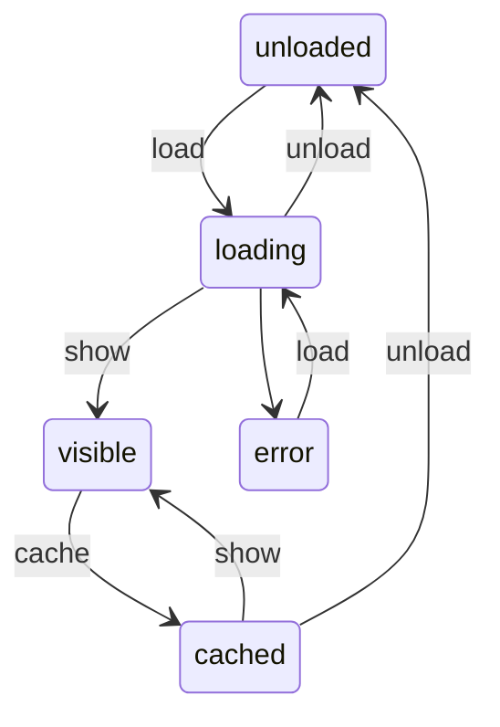

# Pointz

A efficient, simple and hackable WebGL point cloud viewer for the browser.

Supports reading [COPC](https://copc.io) LAZ files.

## Goals:

- Simplicity
- Performance
- Good-looking rendering
- Big scenes with many LAZ files

## Links:

### References

- https://copc.io/copc-specification-1.0.pdf
- https://entwine.io/en/latest/entwine-point-tile.html
- https://publik.tuwien.ac.at/files/publik_252607.pdf

### three.js

- https://discoverthreejs.com/tips-and-tricks/
- https://webglinsights.github.io/tips.html
- https://threejs.org/docs/#manual/en/introduction/How-to-use-post-processing

## Pointcloud Node State Machine

## Notes

- If shrinking the browser window results in massive speed gains, consider using a half-resolution framebuffer during mouse interaction.

- FXAA/SMAA post-processing step?

  - https://threejs.org/examples/webgl_postprocessing_fxaa.html
  - https://threejs.org/examples/#webgl_postprocessing_smaa

- How to only draw EDL for points?

  - https://threejs.org/examples/webgl_postprocessing_unreal_bloom_selective.html
  - https://threejs.org/examples/webgl_postprocessing_outline.html

- Other optimizations
  - https://www.khronos.org/opengl/wiki/Buffer_Object#Buffer_Object_Usage
