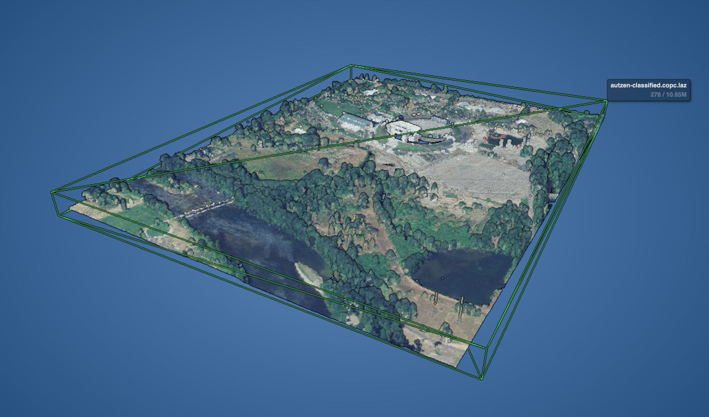
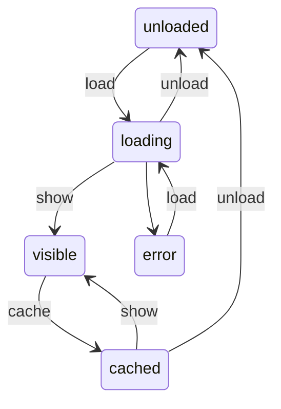

# Pointz

A simple WebGL point cloud viewer for the browser. Inspired by [Potree](https://github.com/potree/potree).

[Open Example](https://pointz.aolagers.org/)

## Features

- Efficient loading and rendering of [COPC LAZ](https://copc.io) files.
- Intuitive Google Earth -like camera controls for both desktop and mobile.
- Eye-Dome Lighting (EDL) shader for easier depth perception

## Links

- References
  - https://copc.io/copc-specification-1.0.pdf
  - https://entwine.io/en/latest/entwine-point-tile.html
  - https://publik.tuwien.ac.at/files/publik_252607.pdf
- three.js
  - https://discoverthreejs.com/tips-and-tricks/
  - https://webglinsights.github.io/tips.html

## Point Cloud Node states

