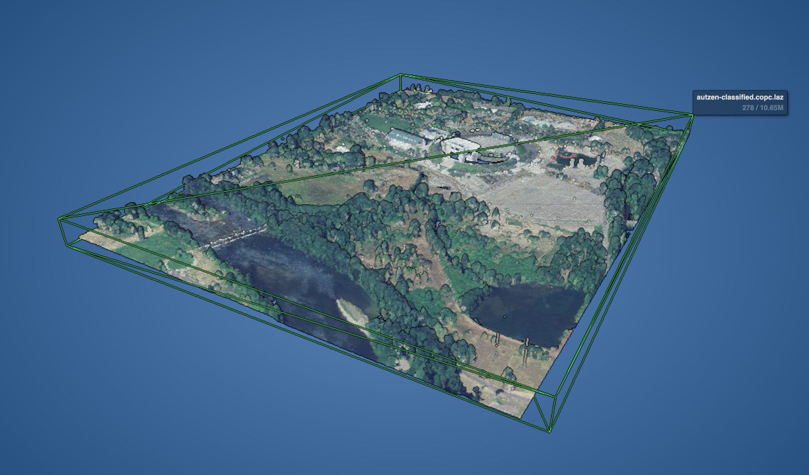
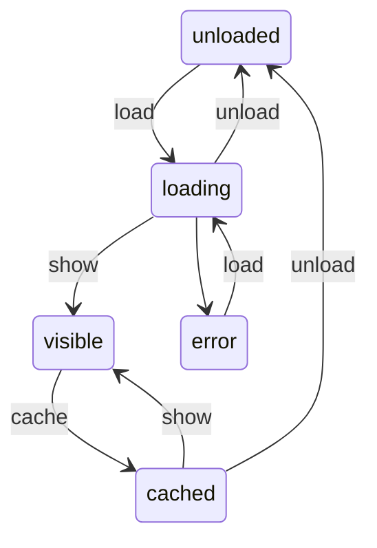

# Pointz

A simple and hackable WebGL point cloud viewer for the browser. Inspired by [Potree](https://github.com/potree/potree).

[Open Example](https://aolagers.github.io/pointz/)

## Features

-   Efficient loading and rendering of [COPC LAZ](https://copc.io) files.
-   Easy Google Earth -like controls for both desktop and mobile.
-   Eye-Dome Lighting (EDL) shader for better depth perception

## Links

-   Reference
    -   https://copc.io/copc-specification-1.0.pdf
    -   https://entwine.io/en/latest/entwine-point-tile.html
    -   https://publik.tuwien.ac.at/files/publik_252607.pdf
-   three.js
    -   https://discoverthreejs.com/tips-and-tricks/
    -   https://webglinsights.github.io/tips.html
    -   https://threejs.org/docs/#manual/en/introduction/How-to-use-post-processing

## Point Cloud Node states

